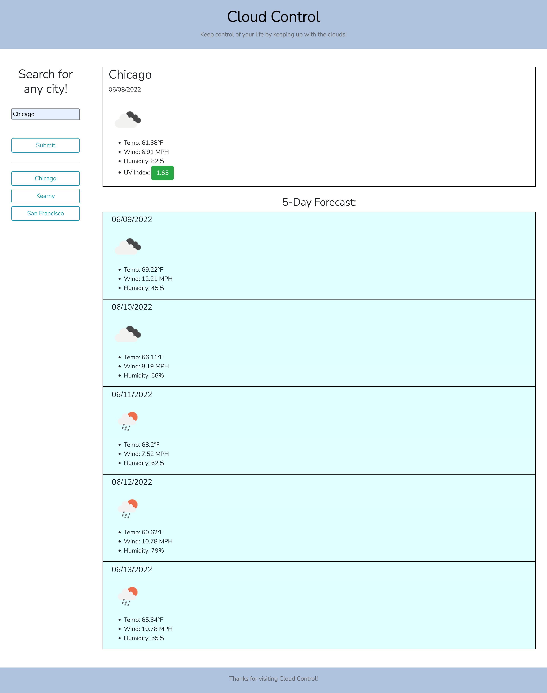

# Cloud-Control
## Description:
The files found with this README file come together to create a weather dashboard. No code was given and this was made from scratch.

## HTML
In the HTML file, I did multiple things. I:

- Used Bootstrap to create:
    - rows, columns and containers to properly hold all of my elements and information.
    - a responsive and appealing website
- Created a form to gather user input
- Created mostly elements that would hold future information

## CSS
In the CSS file, I made minor changes to make the website more on brand and personalized.

## Javascript
In the Javascript file, I did multiple things. I:
- Created many variables and arrays which held the locations of where future information would go
- Created an empty array that would be filled out as one continued to search
- Created functions that:
    - found the latitude and longitude of the entered city, then found and displayed the current weather along with a 5 day forecast. Additionally, this function found and displayed the dates in connection to the current time and the next 5 days. It also created 'recently searched' buttons, added cities to the empty array mentioned earlier and stored that array to local storage.
    - resubmitted previously searched cities into the weather finder and displayer.
    - initialized the page so that 'recently searched' buttons would remain even if the page was reloaded (did this with local storage involvement).
- Added event listeners to some buttons so that certain functions would run when clicked.
- Called the initialization function so that the page would load as desired.

## Some Problem(s)/Explanation(s)
I feel the need to explain some thing(s) so I have done so below:

- I apologize for submitting this late! I am doing my best to catch up with my work after falling sick on top of already being behind because of my graduation. I plan to be caught up on everything before this weekend.
- I was unable to figure out how to break up my biggest function. I attempted multiple things, however, nothing worked since the API call(s) needed to finish before I could let the rest of the code run. Thus, I was unsure of how to fix it. I used the '.then()' method to break up the code as well as have it run in the correct order. Please let me know if there was a better way to do this.

Please do not hesitate to inform or advise me on anything in my code that could be done better. I truly appreciate the help!

## Screenshot:
Here is a screenshot of the deployed application:

## Link to deployed application:

Here is the link to the deployed application via GitHub:

<a href="https://alylopez02.github.io/Cloud-Control/">https://alylopez02.github.io/Cloud-Control/</a>